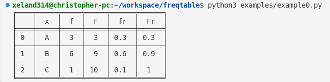
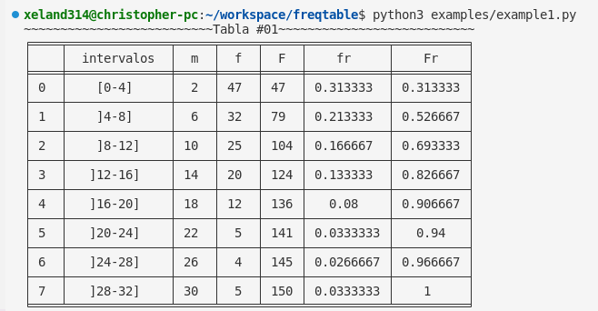

# freqtables

Este paquete permite crear tablas de frecuencias simples dado un conjunto de variables con sus respectivas frecuencias. Este conjunto de datos pueder una lista, tuple o un diccionario:

## freqtablesimple

```python
import freqtable as ft

tabla1 = ft.FreqTableSimple([
    'A', 'A', 'A', 'B', 'B',
    'B', 'B', 'B', 'B', 'C'
])
tabla2 = ft.FreqTableSimple({
    'A':3, 'B':6, 'C':1
})
tabla3 = ft.FreqTableSimple(
    'A', 'A', 'A', 'B', 'B',
    'B', 'B', 'B', 'B', 'C'
)
tabla4 = ft.FreqTableSimple(
    A = 3, B = 6, C = 1
)
```

Cualquiera de estas dos formas de inicializar ```FreqTableSimple``` dando como resultado:

```python
print(tabla1)
```
<center>


</center>

## freqtable

También es posible crear una tabla de frecuencias con intervalos utilizando ```freqtable.py```.
Para esto, hacemos lo siguiente:

```python
# example1.py
import freqtable as ft

# Se crean 8 intervalos desde 0 con ancho de 4:
intervalos = ft.crear_intervalos(8, 0, 4)
frecuencias = [47, 32, 25, 20, 12, 5, 4, 5]
# Se inicializa la tabla con los intervalos y frecuencias:
tabla_con_intervalos = ft.FreqTable(intervalos, frecuencias)
```

Dando como resultado:
```python
print("Tabla #01".center(62, "~"))
print(tabla_con_intervalos)
```

<center>


</center>

## Instalación

Se puede clonar este repositorio:

```bash
git clone https://github.com/xeland314/freqtables
```

Y luego instalar las demás dependencias:

```bash
pip3 install -r requirements.txt
```

<details>
<summary>requirements.txt</summary>

- tabulate>=0.8.10

</details>
